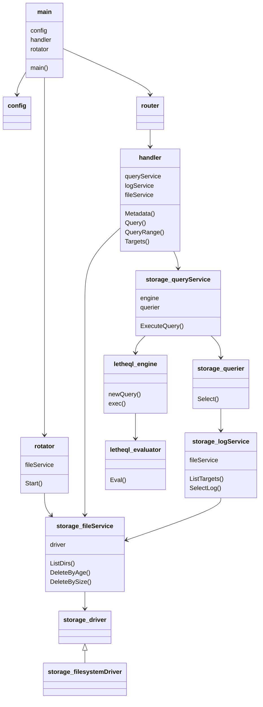

```mermaid
classDiagram

main --> config
main --> router
main --> rotator

router --> handler

rotator --> storage_fileService

handler --> storage_fileService
handler --> storage_queryService

storage_querier --> storage_logService

storage_queryService --> storage_querier
storage_queryService --> letheql_engine
storage_logService --> storage_fileService
storage_fileService --> storage_driver

letheql_engine --> letheql_evaluator

storage_driver <|-- storage_filesystemDriver

class main {
    config
    handler
    rotator
    main()
}

class rotator {
    fileService
    Start()
}

class handler {
    queryService
    logService
    fileService
    Metadata()
    Query()
    QueryRange()
    Targets()
}

class storage_querier {
    Select()
}

class storage_queryService {
    engine
    querier
    ExecuteQuery()
}

class storage_logService {
    fileService
    ListTargets()
    SelectLog()
}

class storage_fileService {
    driver
    ListDirs()
    DeleteByAge()
    DeleteBySize()
}


class letheql_engine {
    newQuery()
    exec()
}

class letheql_evaluator {
    Eval()
}
```
