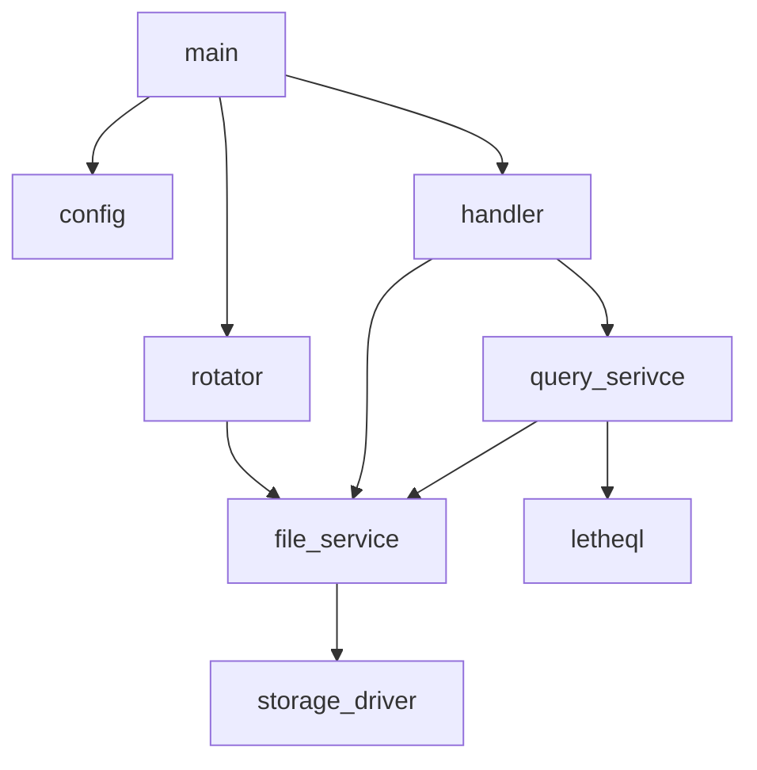
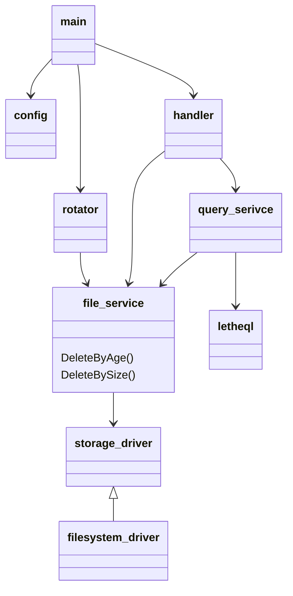

```mermaid
flowchart TD
main --> config
main --> handler
main --> rotator
rotator --> file_service
handler --> file_service
handler --> query_serivce
query_serivce --> file_service
query_serivce --> letheql
file_service --> storage_driver
```

```mermaid
classDiagram
main --> config
main --> handler
main --> rotator
rotator --> file_service
handler --> file_service
handler --> query_serivce
query_serivce --> file_service
query_serivce --> letheql
file_service --> storage_driver
storage_driver <|-- filesystem_driver

class rotator {
    
}

class file_service{
    DeleteByAge()
    DeleteBySize()
}
```
