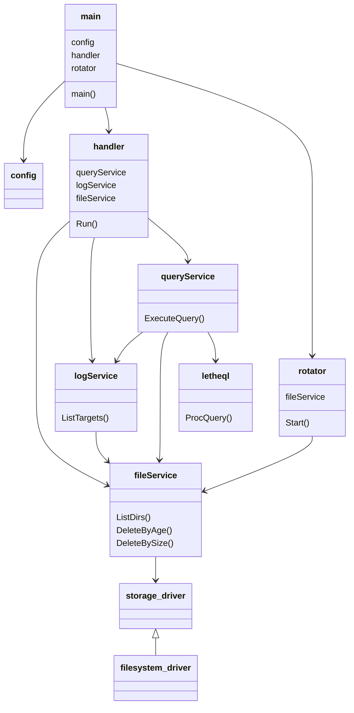

```mermaid
classDiagram

main --> config
main --> handler
main --> rotator

handler --> fileService
handler --> logService
handler --> queryService
rotator --> fileService

queryService --> logService
queryService --> fileService
queryService --> letheql
logService --> fileService
fileService --> storage_driver

storage_driver <|-- filesystem_driver

class main {
    config
    handler
    rotator
    main()
}

class rotator {
    fileService
    Start()
}

class handler {
    queryService
    logService
    fileService
    Run()
}

class queryService {
    ExecuteQuery()
}

class logService {
    ListTargets()
}

class fileService {
    ListDirs()
    DeleteByAge()
    DeleteBySize()
}


class letheql {
    ProcQuery()
}
```
